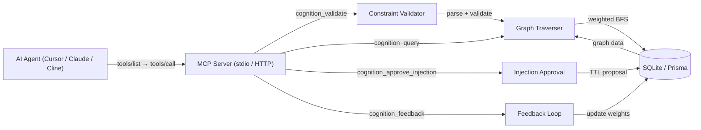

# MCP Rule Engine — Cognition Engine & Trust Governance Layer

> A production-grade MCP server that combines a cognition graph engine with a trusted governance layer. Provides intelligent code pattern matching, AST-level constraint validation, and auditable injection approval for AI agents.

## Core Features

- **Cognition Graph Engine** — Intent recognition, weighted graph traversal, and AST constraint solving for intelligent code analysis
- **Trust Governance** — Three-tier knowledge base with injection approval workflow, TTL-based proposals, and audit logging
- **Dual Transport** — Stdio (local) and Streamable HTTP (remote) transports with full MCP lifecycle support
- **Agent Hard Constraints** — Output schema enforcement with `validationRequired` auto-validation; non-compliant agent responses intercepted
- **Hot Config Updates** — Dynamic threshold tuning with expert mode authorization and version chain tracking

---

## Architecture



---

## Quick Start

### Prerequisites

- Node.js >= 18
- npm >= 9

### Setup

```bash
git clone <repo-url> && cd mcp-rule-engine
npm install
npx prisma db push
npm run build
```

### Start Server

```bash
# Stdio mode (default)
node dist/index.js

# HTTP mode
TRANSPORT=http PORT=3000 node dist/index.js
```

---

## MCP Integration

### Cursor

Add to `.cursor/mcp.json`:

```json
{
  "mcpServers": {
    "cognition-engine": {
      "command": "node",
      "args": ["dist/index.js"],
      "env": { "DATABASE_URL": "file:./dev.db" }
    }
  }
}
```

### Claude Desktop

Add to `claude_desktop_config.json`:

```json
{
  "mcpServers": {
    "cognition-engine": {
      "command": "node",
      "args": ["path/to/mcp-rule-engine/dist/index.js"],
      "env": { "DATABASE_URL": "file:./dev.db" }
    }
  }
}
```

### Cline / Roo Code (HTTP)

```json
{
  "mcpServers": {
    "cognition-engine": {
      "url": "http://localhost:3000",
      "transport": "streamable-http"
    }
  }
}
```

---

## Trust Governance Protocol

### Three-Tier Knowledge

| Tier | Scope | Node Type | Validation |
|------|-------|-----------|------------|
| Global | Universal patterns | NegativeConstraint = REJECT | Hard block |
| Project | Project conventions | PositiveConstraint = WARN | Soft warning |
| Reuse | Cross-project patterns | Intent + Heuristic | Weight-based |

### Injection Approval Flow

```
Agent → cognition_query (implicit Proposal + TTL=5min)
  → User reviews results
  → cognition_approve_injection(proposalId, APPROVE|REJECT|OVERRIDE)
  → Audit log recorded
```

Proposals are in-memory with a 5-minute TTL. Concurrent proposals for the same context hash return the existing proposal to prevent conflicts. Expired proposals return `-32602 Proposal Expired` with `retryable: true`.

### Constraint Validation Dual-Mode

- **REJECT (Hard Block)**: Returned as `-32602` + `ruleId`. Agent must stop.
- **WARN (Soft Warning)**: Returned as violation. Agent may continue with user confirmation.

### Config Hot Update

Dynamic thresholds (similarity 0.7/0.9) are stored as `CognitionNode(type=HEURISTIC)`. Each update creates a new version node with the old node marked `supersededBy`. Requires `expertMode: true`.

### Audit & Compliance

All injection decisions, config changes, and validation events are recorded via `MetricEvent` with async non-blocking writes. On database write failure, events fall back to `logs/fallback.log`.

---

## MCP Resources

| URI | Type | Content |
|-----|------|---------|
| `cognition://schema` | application/json | Cognition graph data model |
| `cognition://stats` | application/json | Node/edge counts + approvalRate7d |
| `cognition://docs` | text/markdown | Full tool documentation |
| `cognition://rules-changelog` | application/json | Versioned rule change log |

---

## MCP Tools

| Tool | Description | readOnlyHint |
|------|-------------|:---:|
| `cognition_query` | Query graph by context hash | ✅ |
| `cognition_validate` | Validate code against AST templates | ✅ |
| `cognition_feedback` | Provide feedback to refine traversal | ❌ |
| `cognition_approve_injection` | Approve/reject proposals with TTL | ❌ |
| `cognition_update_config` | Hot-update thresholds (expert mode) | ❌ |

---

## Testing

```bash
# Run all tests (118/118 passing)
npm test

# Run specific suite
npx vitest run tests/protocol/
```

---

## Protocol Compliance

This server conforms to **MCP Specification v1.29.0** and supports:

- [x] initialize / initialized / ping / shutdown lifecycle
- [x] tools/list + tools/call with JSON Schema input/output
- [x] resources/list + resources/read with `cognition://` URI scheme
- [x] StdioServerTransport and StreamableHTTPServerTransport
- [x] Error codes: -32602 (invalid params), -32603 (internal), -32001 (timeout)
- [x] Annotations: readOnlyHint, destructiveHint, openWorldHint

---

## License

MIT — see [LICENSE](LICENSE).
